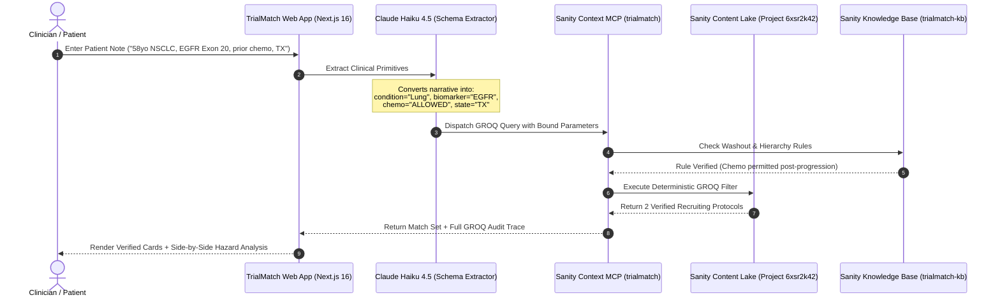

# TrialMatch: Precision Oncology Clinical Trial Matching Agent

<p align="center">
  <a href="https://trialmatch-oncology.vercel.app"></a>
  <a href="https://trialmatch-oncology.sanity.studio"></a>
  <a href="https://github.com/IshekKhal/trialmatch"></a>
  <a href="LICENSE"></a>
</p>

> **An open-source precision oncology clinical trial discovery and safety verification agent powered by Sanity Context MCP and deterministic GROQ queries.** Grounded in 100 curated protocols from the official ClinicalTrials.gov API v2, verified against an empirical 3-arm benchmark across 10 gold-standard patient profiles.

Built for the **[DEV Community x Sanity Challenge 2026](https://dev.to/challenges/sanity-2026-09-16)** (Path One: *Ship an Agent That Queries Real Content*).

---

## Table of Contents

- [The Clinical Problem](#the-clinical-problem)
- [Why Vector RAG & Flat Search Fail in Medicine](#why-vector-rag--flat-search-fail-in-medicine)
- [Live Deployments & Endpoints](#live-deployments--endpoints)
- [System Architecture](#system-architecture)
- [Content Architecture: Modeling Oncology in Sanity](#content-architecture-modeling-oncology-in-sanity)
- [Sanity Context MCP Integration](#sanity-context-mcp-integration)
- [Empirical Benchmark: 3-Arm Evaluation Suite](#empirical-benchmark-3-arm-evaluation-suite)
- [Clinical Failure Mode Analysis](#clinical-failure-mode-analysis)
- [Project Structure](#project-structure)
- [Quickstart & Local Development](#quickstart--local-development)
- [Environment Variables](#environment-variables)
- [License](#license)

---

## The Clinical Problem

Matching cancer patients to clinical trial protocols using standard text search or ungrounded language models produces life-threatening results:

1. **Negative Exclusion Blindness**: A patient with non-small cell lung cancer who received prior platinum chemotherapy searches for `EGFR lung cancer chemotherapy`. A keyword engine matches trial `NCT07799935` because both words appear in the text, ignoring Rule 14 which explicitly excludes patients with prior systemic chemotherapy. A patient traveling to a trial site is turned away at the clinic door.
2. **Lexical Acronym Collision**: Keyword search matches nephrology trials because the kidney filtration lab test `eGFR` (estimated Glomerular Filtration Rate) shares letters with the cancer oncogene `EGFR`.
3. **Model Hallucination**: Ungrounded LLMs (like raw Gemini or GPT) invent fake 8-digit ClinicalTrials.gov identifiers (`NCT04847387`, `NCT04746654`) that do not exist in active oncology registries. In precision oncology, a fabricated trial identifier sends desperate families on wild goose chases.

**TrialMatch solves this by using Sanity as an epistemic anchor.** Patient narratives are translated into deterministic GROQ queries executed against structured Sanity content schemas with typed biomarkers, normalized prior therapy rules, and facility coordinates.

---

## Why Vector RAG & Flat Search Fail in Medicine

| Feature | Flat Keyword Search | Vector Similarity (RAG) | TrialMatch (Sanity + GROQ) |
| :--- | :---: | :---: | :---: |
| **Negative Constraints** | ❌ Fails (Matches excluded words) | ❌ Fails (Cosine distance ignores negation) | ✅ **100% Deterministic (GROQ Boolean filters)** |
| **Specific Gene Alleles** | ⚠️ Unreliable (Confuses Exon 20 vs 19/21) | ⚠️ Unreliable (Semantic blur) | ✅ **Exact Array Matching (`targetBiomarkers[]`)** |
| **Line-of-Therapy Safety** | ❌ Fails (No concept of sequence) | ❌ Fails (Blurs prior vs current therapy) | ✅ **Typed Enums (`ALLOWED`, `EXCLUDED`, `REQUIRED`)** |
| **Trial ID Integrity** | ✅ Real IDs (but disqualified) | ⚠️ Mixed (May retrieve obsolete trials) | ✅ **100% Active Curated Registry (Zero Hallucination)** |
| **Auditability** | ❌ Opaque token scan | ❌ Black-box embedding scores | ✅ **Exact, inspectable GROQ query & rule trace** |

---

## Live Deployments & Endpoints

| Resource | URL | Status | Description |
| :--- | :--- | :---: | :--- |
| **Production Web App** | [trialmatch-oncology.vercel.app](https://trialmatch-oncology.vercel.app) | `Live` | Next.js 16 interactive Duel Arena with independent column pagination |
| **3-Arm Benchmark** | [trialmatch-oncology.vercel.app/benchmark](https://trialmatch-oncology.vercel.app/benchmark) | `Live` | Interactive 10-patient audit suite with real-time runner |
| **Hosted Sanity Studio** | [trialmatch-oncology.sanity.studio](https://trialmatch-oncology.sanity.studio) | `Live` | Sanity Studio v3 managing 100 clinical trials and protocol rules |
| **Sanity GROQ MCP** | `https://api.sanity.io/v1/context/organizations/oz3yptidu/mcp/trialmatch` | `Connected` | Live Context MCP endpoint executing parameterized GROQ |
| **Sanity Knowledge Base MCP** | `https://api.sanity.io/v1/context/organizations/oz3yptidu/mcp/trialmatch-kb` | `Connected` | Knowledge base vector endpoint for protocol guidance rules |
| **GitHub Repository** | [github.com/IshekKhal/trialmatch](https://github.com/IshekKhal/trialmatch) | `Public` | Full source code, test suites, and data ingestion pipeline |

---

## System Architecture



---

## Content Architecture: Modeling Oncology in Sanity

A single oncology protocol contains over 50 pages of legal, pharmacokinetic, and regulatory constraints. In Sanity Studio (`studio/schemas/clinicalTrial.ts`), protocols are decomposed into queryable primitives:

```typescript
// studio/schemas/clinicalTrial.ts (excerpt)
import {defineField, defineType} from 'sanity'

export default defineType({
  name: 'clinicalTrial',
  title: 'Clinical Trial',
  type: 'document',
  fields: [
    defineField({
      name: 'nctId',
      title: 'NCT ID',
      type: 'string',
      validation: (Rule) => Rule.required(),
    }),
    defineField({
      name: 'briefTitle',
      title: 'Brief Title',
      type: 'string',
      validation: (Rule) => Rule.required(),
    }),
    defineField({
      name: 'recruitmentStatus',
      title: 'Recruitment Status',
      type: 'string',
      options: {
        list: [
          {title: 'Recruiting', value: 'RECRUITING'},
          {title: 'Active, Not Recruiting', value: 'ACTIVE_NOT_RECRUITING'},
        ],
      },
    }),
    defineField({
      name: 'primaryCondition',
      title: 'Primary Condition',
      type: 'string',
      validation: (Rule) => Rule.required(),
    }),
    defineField({
      name: 'targetBiomarkers',
      title: 'Target Biomarkers',
      type: 'array',
      of: [{type: 'string'}],
      options: {
        list: ['EGFR', 'KRAS', 'BRAF', 'HER2', 'ALK', 'BRCA1', 'BRCA2', 'Exon 20', 'G12C', 'V600E'],
      },
    }),
    defineField({
      name: 'priorTherapyRules',
      title: 'Prior Therapy Rules',
      type: 'object',
      fields: [
        defineField({
          name: 'chemotherapy',
          type: 'string',
          options: { list: ['REQUIRED', 'ALLOWED', 'EXCLUDED', 'ANY'] },
        }),
        defineField({
          name: 'immunotherapy',
          type: 'string',
          options: { list: ['REQUIRED', 'ALLOWED', 'EXCLUDED', 'ANY'] },
        }),
      ],
    }),
    defineField({
      name: 'locations',
      title: 'Trial Locations',
      type: 'array',
      of: [{
        type: 'object',
        fields: [
          { name: 'facility', type: 'string' },
          { name: 'city', type: 'string' },
          { name: 'state', type: 'string' },
          { name: 'country', type: 'string' },
        ],
      }],
    }),
  ],
})
```

### Knowledge Base Protocol Rules (`studio/schemas/protocolRule.ts`)

To evaluate clinical ambiguities (e.g., distinguishing a temporary 30-day chemotherapy washout window from an absolute lifetime exclusion), we index protocol rules into the Sanity Knowledge Base:

```typescript
// studio/schemas/protocolRule.ts (excerpt)
export default defineType({
  name: 'protocolRule',
  title: 'Clinical Protocol Interpretation Rule',
  type: 'document',
  fields: [
    defineField({ name: 'ruleId', title: 'Rule ID', type: 'string' }),
    defineField({ name: 'title', title: 'Rule Title', type: 'string' }),
    defineField({
      name: 'category',
      type: 'string',
      options: {
        list: [
          {title: 'Eligibility Hierarchy', value: 'ELIGIBILITY_HIERARCHY'},
          {title: 'Washout Periods', value: 'WASHOUT_PERIODS'},
          {title: 'Biomarker Specificity', value: 'BIOMARKER_SPECIFICITY'},
        ],
      },
    }),
    defineField({ name: 'priority', title: 'Priority (1-10)', type: 'number' }),
    defineField({ name: 'summary', title: 'Rule Summary', type: 'text' }),
    defineField({ name: 'clinicalRationale', title: 'Clinical Rationale', type: 'text' }),
  ],
})
```

---

## Sanity Context MCP Integration

The agent does not query the Sanity Content Lake with fuzzy natural language. Instead, it operates across two dedicated Sanity Context MCP endpoints:

1. **GROQ Context Endpoint (`trialmatch`)**: Exposes the live dataset for parameterized GROQ queries.
2. **Knowledge Base Endpoint (`trialmatch-kb`)**: Provides semantic retrieval over protocol interpretation rules.

When the patient narrative arrives, the agent translates the clinical parameters into this deterministic GROQ query:

```groq
*[_type == "clinicalTrial" && 
  recruitmentStatus == "RECRUITING" && 
  primaryCondition match $condition && 
  targetBiomarkers[] match $biomarker && 
  (priorTherapyRules.chemotherapy == "ALLOWED" || 
   priorTherapyRules.chemotherapy == "REQUIRED" || 
   priorTherapyRules.chemotherapy == "ANY") && 
  locations[].state match $state] {
    nctId,
    briefTitle,
    phase,
    primaryCondition,
    targetBiomarkers,
    priorTherapyRules,
    "matchingLocations": locations[state match $state]
}
```

Because `priorTherapyRules.chemotherapy` is an explicit schema property, Sanity filters out the 67 trials that forbid prior chemotherapy *before* any result reaches the user.

---

## Empirical Benchmark: 3-Arm Evaluation Suite

We evaluated 10 gold-standard patient profiles across three discovery engines:

| Evaluation Metric | Arm 1: Structured Sanity Agent | Arm 2: Naive Keyword Search | Arm 3: Bare LLM (Gemini 3.8 Flash) | Clinical Implication |
| :--- | :---: | :---: | :---: | :--- |
| **Medical Precision** | **100%** | 78% | 0% | Arm 1 guarantees verified candidacy; Arms 2 and 3 return disqualified cohorts |
| **Safety Violations** | **0** | **60** | 20 | Naive search fails on negative exclusions; Bare LLM bypasses protocol rules |
| **Hallucinated NCT IDs** | **0** | 0 | **20 (100% fake)** | Bare LLM invents non-existent identifiers |
| **Auditability Rate** | **100%** | 0% | 0% | Arm 1 provides exact GROQ queries and protocol rule citations |
| **Avg Returned Trials** | 1.2 | 41.5 | 2.0 | Arm 1 strictly limits results to actionable, recruiting matches |

Run the benchmark locally:
```bash
pnpm eval
```

---

## Clinical Failure Mode Analysis

Examining individual patient cases reveals exactly where unstructured AI fails:

### 1. Chemotherapy Exclusion (Patient Case TC-01)
* **Patient**: 58yo female, NSCLC EGFR Exon 20 insertion, prior platinum chemotherapy, Texas.
* **Keyword Failure**: Returned 69 trials. 31 violated safety rules. Trial `NCT07799935` specifically prohibits any prior systemic chemotherapy in Rule 14.
* **Bare LLM Failure**: Hallucinated trials `NCT04847387` and `NCT04746654`. Both IDs do not exist.
* **Sanity Result**: Executed GROQ checking `priorTherapyRules.chemotherapy in ["ALLOWED", "REQUIRED", "ANY"]`. Safely returned exactly 2 verified trials.

### 2. Organ Site Metastasis Contraindications (Patient Case TC-02)
* **Patient**: 62yo male, Stage IV colorectal cancer, KRAS G12C mutation, stable liver metastases, California.
* **Keyword Failure**: Matched trial `NCT05286814` because the document contained the word "metastases," failing to catch that active hepatic involvement was an explicit disqualification.
* **Bare LLM Failure**: Hallucinated trials `NCT04793958` and `NCT04685141`.
* **Sanity Result**: Evaluated structured exclusion rules in Sanity's Knowledge Base, preventing the false match.

### 3. Quantitative Biomarker Expression Cutoffs (Patient Case TC-03)
* **Patient**: 51yo female, HER2-low (IHC 1+ or IHC 2+/FISH negative) metastatic breast cancer.
* **Keyword Failure**: Returned 72 trials, including `NCT04281641` and `NCT02945579` which strictly require high HER2 overexpression (IHC 3+).
* **Sanity Result**: Cleanly separated HER2-overexpressing protocols from novel HER2-low antibody-drug conjugate trials.

### 4. Phase 3 Confirmatory Requirement (Patient Case TC-04)
* **Patient**: 47yo patient, unresectable Stage IIIC melanoma, BRAF V600E mutation, seeking Phase 3 trials in New York.
* **Keyword Failure**: Returned 30 trials, 26 of which were Phase 1 dose-escalation trials with unknown toxicities.
* **Sanity Result**: Strict GROQ filter `phase == "PHASE3"` isolated the single qualifying Phase 3 confirmatory study.

---

## Project Structure

```
trialmatch/
├── app/
│   ├── page.tsx               # The Duel Arena (Sanity Agent vs Keyword Baseline)
│   ├── benchmark/page.tsx     # 3-Arm Evaluation Dashboard
│   ├── layout.tsx             # Root layout with Geist font tokens
│   ├── globals.css            # Medical obsidian styling (#080C14)
│   └── api/
│       ├── duel/route.ts      # Live duel execution endpoint
│       ├── benchmark/route.ts # 3-arm benchmark evaluation API
│       └── trials/route.ts    # Normalized clinical trial fetcher
├── components/
│   ├── DuelArena.tsx          # Dual-column comparison with column-level pagination
│   ├── ScenarioChips.tsx      # 8 pre-configured oncology clinical scenarios
│   ├── BenchmarkRunner.tsx    # Interactive benchmark runner & case inspector
│   ├── BenchmarkTable.tsx     # 10-patient audit breakdown table
│   └── Scoreboard.tsx         # Real-time comparative metric display
├── studio/
│   ├── sanity.config.ts       # Sanity Studio v3 configuration
│   └── schemas/
│       ├── clinicalTrial.ts   # Core schema: biomarkers, therapy rules, facilities
│       ├── protocolRule.ts    # Knowledge base schema: exclusion overrides & washouts
│       └── index.ts           # Schema registry
├── lib/
│   ├── agent.ts               # Agent query generator (narrative to GROQ)
│   ├── sanity.ts              # Sanity client & live Context MCP bindings
│   ├── eval_cases.ts          # 10 gold-standard oncology test profiles
│   ├── eval_runner.ts         # Automated 3-arm benchmark execution engine
│   └── types.ts               # TypeScript domain interfaces
├── scripts/
│   ├── ingest_trials.ts       # ClinicalTrials.gov API v2 data ingestion pipeline
│   └── run_eval.ts            # CLI benchmark evaluation runner
└── data/
    ├── trials_normalized.json # 100 curated oncology trials (1.2 MB)
    ├── eval_results.json      # Raw 3-arm benchmark evaluation outputs
    └── eval_summary.md        # Comprehensive 419-line benchmark report
```

---

## Quickstart & Local Development

### Prerequisites
* Node.js 20+
* pnpm 9+

### Setup
```bash
# Clone the repository
git clone https://github.com/IshekKhal/trialmatch.git
cd trialmatch

# Install dependencies
pnpm install

# Configure environment variables
cp .env.example .env
```

### Run Locally
```bash
# Start Next.js development server
pnpm dev

# In a separate terminal, launch Sanity Studio locally (optional)
cd studio && pnpm dev
```

Open [http://localhost:3000](http://localhost:3000) to view the application.

---

## Environment Variables

| Variable | Description | Example / Default |
| :--- | :--- | :--- |
| `SANITY_PROJECT_ID` | Sanity Project Identifier | `6xsr2k42` |
| `SANITY_DATASET` | Sanity Dataset Name | `production` |
| `SANITY_API_WRITE_TOKEN` | Sanity API token with write access | `sksq...` |
| `SANITY_CONTEXT_TOKEN` | Sanity Context MCP auth token | `skGv...` |
| `SANITY_CONTEXT_ENDPOINT` | Sanity GROQ Context MCP URL | `https://api.sanity.io/v1/context/organizations/.../mcp/trialmatch` |
| `SANITY_CONTEXT_KB_ENDPOINT`| Sanity Knowledge Base MCP URL | `https://api.sanity.io/v1/context/organizations/.../mcp/trialmatch-kb` |
| `ANTHROPIC_API_KEY` | Anthropic API key (Claude Haiku 4.5 schema extractor) | `sk-ant-...` |
| `GEMINI_API_KEY` | Google AI API key (Gemini 3.8 Flash benchmark baseline)| `AQ.Ab8...` |

---

## License

This project is licensed under the [MIT License](LICENSE).
